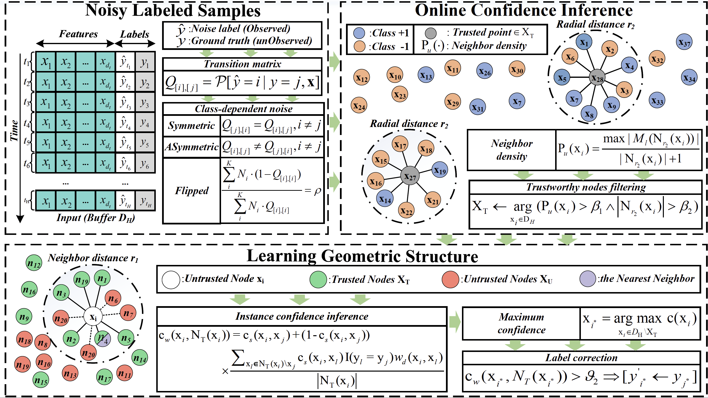

## OLNLS: Online Learning for Noisy Labeled Streams

ACM Transactions on Knowledge Discovery from Data





The comprehensive structure of this project is outlined as follows:

The dataset folder contains three different types of noise data streams, namely symmetric, asymmetric, and flipped noise stream. 

The source folder contains all the code.

The log is for saving last result(e.g. CAR).

The Result is CAR trends. (e.g. CAR, Figure)


## Getting Started
1.Clone the repository.
```
git clone 
```

2.Ensure that the environment meets the software's dependency requirements
```
pip install -r requirements.txt
```

3.Run the program on symmetric noisy labeled streaming
```
python main.py --noise_type sym --dataset wdbc
```

4.Run the program on asymmetric noisy labeled streaming
```
python main.py --noise_type asym --dataset wdbc
```

5.Run the program on flip noisy labeled streaming
```
python main.py --noise_type flip --dataset wdbc
```

